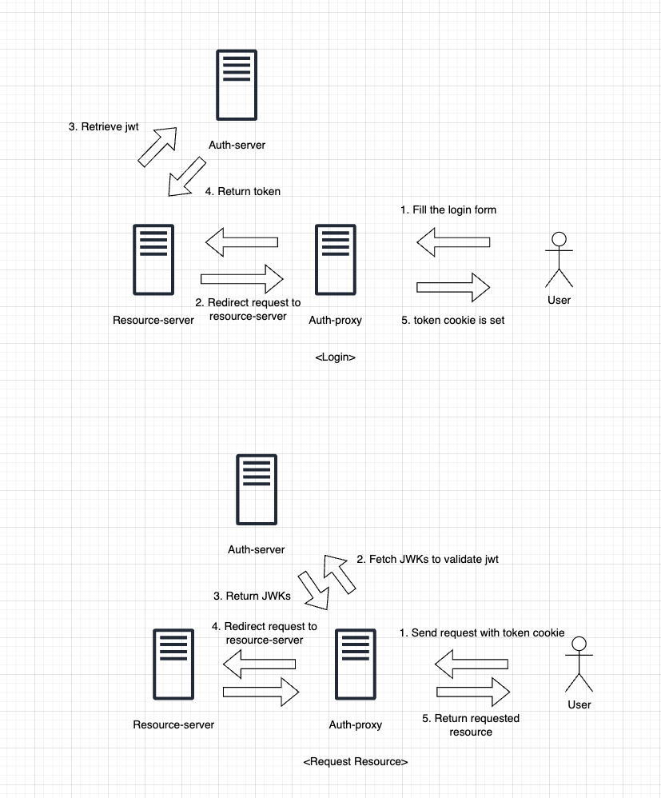

# Envoy jwt filter example

Example app using envoy jwt filter

## Demo

1. Download and install [Docker Desktop](https://www.docker.com/products/docker-desktop/)
2. Run `docker compose up`
```bash
$ docker compose up
```
3. Go to [login page](http://127.0.0.1:10000/login)
4. Use `admin` for username and `1234` for password
5. Boom! You're authenticated

## How it works

There are three components in this demo.

- auth-proxy
- auth-server
- resource-server

Auth-proxy uses [envoy jwt filter](https://www.envoyproxy.io/docs/envoy/latest/api-v3/extensions/filters/http/jwt_authn/v3/config.proto) to authenticate request, and it works as a reverse proxy for resource-server.

Auth-server provides two endpoints, one for getting JWTs and one for getting JWKs.
Auth-proxy makes use of JWK endpoint to get public key for jwt verification.

Resource-server provides resources for end users or other services.

Below is a diagram explaining each user scenarios.


